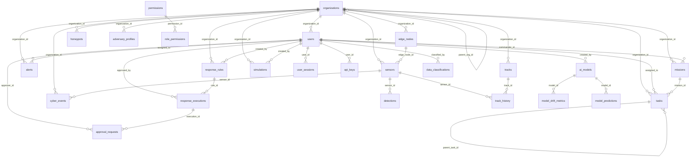

# Sentinel OS — Database Relations & ERD Reference

## Overview

| Database | Purpose | Entities |
|----------|---------|----------|
| **PostgreSQL 16** (PostGIS + TimescaleDB) | Primary relational store | 22 tables |
| **MongoDB 7** | Document store (logs, snapshots) | 7 collections |
| **Neo4j 5** | Graph (entity linking, threat intel) | 17+ node types, 20+ relationships |

---

## PostgreSQL — ENUM Types

| ENUM | Values |
|------|--------|
| `classification_level` | UNCLASSIFIED, CONFIDENTIAL, SECRET, TOP_SECRET, SCI |
| `domain_type` | LAND, AIR, SEA, CYBER, SPACE, INTELLIGENCE, OSINT |
| `threat_severity` | CRITICAL, HIGH, MEDIUM, LOW, INFORMATIONAL |
| `alert_status` | NEW, ACKNOWLEDGED, INVESTIGATING, ESCALATED, RESOLVED, FALSE_POSITIVE, CLOSED |
| `sensor_type` | CCTV, DRONE, RADAR, IOT, ACOUSTIC, SEISMIC, RF, LIDAR, THERMAL, SATELLITE |
| `sensor_status` | ONLINE, OFFLINE, DEGRADED, MAINTENANCE, DECOMMISSIONED |
| `mission_status` | PLANNED, BRIEFED, ACTIVE, PAUSED, COMPLETED, ABORTED, ARCHIVED |
| `task_status` | PENDING, ASSIGNED, IN_PROGRESS, AWAITING_APPROVAL, COMPLETED, FAILED, CANCELLED |
| `task_priority` | FLASH, IMMEDIATE, PRIORITY, ROUTINE, DEFERRED |
| `response_action_type` | BLOCK_IP, ISOLATE_HOST, QUARANTINE_FILE, DISABLE_ACCOUNT, ALERT_OPERATOR, DISPATCH_UNIT, LOCK_PERIMETER, ACTIVATE_COUNTERMEASURE, ESCALATE, LOG_ONLY, CUSTOM |
| `approval_status` | PENDING, APPROVED, REJECTED, EXPIRED, AUTO_APPROVED |
| `user_role` | SYSTEM_ADMIN, SECURITY_ADMIN, ANALYST, OPERATOR, COMMANDER, INTELLIGENCE_OFFICER, CYBER_OPERATOR, OSINT_ANALYST, AUDITOR, VIEWER, API_SERVICE |
| `model_status` | TRAINING, VALIDATING, ACTIVE, DEGRADED, RETIRED, ROLLED_BACK |
| `source_reliability` | A_RELIABLE → F_CANNOT_BE_JUDGED (NATO Admiralty Code) |
| `information_credibility` | 1_CONFIRMED → 6_CANNOT_BE_JUDGED (NATO Admiralty Code) |

---

## PostgreSQL — Tables & Columns

### 1. organizations

| Column | Type | Constraints |
|--------|------|-------------|
| id | UUID | PK |
| name | VARCHAR(255) | UNIQUE, NOT NULL |
| short_code | VARCHAR(16) | UNIQUE, NOT NULL |
| parent_org_id | UUID | FK → organizations(id) |
| classification_ceiling | classification_level | NOT NULL |
| country_code | CHAR(3) | NOT NULL |
| is_active | BOOLEAN | DEFAULT true |
| metadata | JSONB | DEFAULT '{}' |
| created_at | TIMESTAMPTZ | DEFAULT NOW() |
| updated_at | TIMESTAMPTZ | DEFAULT NOW() |

### 2. users

| Column | Type | Constraints |
|--------|------|-------------|
| id | UUID | PK |
| organization_id | UUID | FK → organizations(id), NOT NULL |
| username | VARCHAR(128) | UNIQUE(org_id, username) |
| email | VARCHAR(255) | UNIQUE |
| password_hash | VARCHAR(255) | — |
| role | user_role | NOT NULL, DEFAULT 'VIEWER' |
| clearance_level | classification_level | NOT NULL |
| is_active | BOOLEAN | DEFAULT true |
| is_locked | BOOLEAN | DEFAULT false |
| locked_until | TIMESTAMPTZ | — |
| failed_login_count | INT | DEFAULT 0 |
| mfa_enabled | BOOLEAN | DEFAULT false |
| mfa_secret_enc | BYTEA | — |
| mfa_recovery_codes_enc | BYTEA | — |
| last_login_at | TIMESTAMPTZ | — |
| last_login_ip | INET | — |
| password_changed_at | TIMESTAMPTZ | DEFAULT NOW() |
| federation_provider | VARCHAR(64) | — |
| federation_subject | VARCHAR(512) | — |
| metadata | JSONB | DEFAULT '{}' |
| created_at / updated_at | TIMESTAMPTZ | DEFAULT NOW() |

### 3. user_sessions

| Column | Type | Constraints |
|--------|------|-------------|
| id | UUID | PK |
| user_id | UUID | FK → users(id) ON DELETE CASCADE |
| refresh_token_hash | VARCHAR(128) | UNIQUE |
| ip_address | INET | NOT NULL |
| user_agent | TEXT | — |
| expires_at | TIMESTAMPTZ | NOT NULL |
| revoked_at | TIMESTAMPTZ | — |
| created_at | TIMESTAMPTZ | DEFAULT NOW() |

### 4. api_keys

| Column | Type | Constraints |
|--------|------|-------------|
| id | UUID | PK |
| user_id | UUID | FK → users(id) ON DELETE CASCADE |
| name | VARCHAR(128) | NOT NULL |
| key_hash | VARCHAR(128) | UNIQUE |
| key_prefix | VARCHAR(12) | NOT NULL |
| permissions | JSONB | DEFAULT '[]' |
| rate_limit | INT | DEFAULT 1000 |
| expires_at | TIMESTAMPTZ | — |
| last_used_at | TIMESTAMPTZ | — |
| is_active | BOOLEAN | DEFAULT true |
| created_at | TIMESTAMPTZ | DEFAULT NOW() |

### 5. permissions

| Column | Type | Constraints |
|--------|------|-------------|
| id | UUID | PK |
| resource | VARCHAR(128) | UNIQUE(resource, action) |
| action | VARCHAR(64) | NOT NULL |
| description | TEXT | — |

### 6. role_permissions

| Column | Type | Constraints |
|--------|------|-------------|
| role | user_role | PK (composite) |
| permission_id | UUID | PK (composite), FK → permissions(id) ON DELETE CASCADE |
| conditions | JSONB | DEFAULT '{}' |
| granted_by | UUID | FK → users(id) |
| created_at | TIMESTAMPTZ | DEFAULT NOW() |

### 7. data_access_policies

| Column | Type | Constraints |
|--------|------|-------------|
| id | UUID | PK |
| name | VARCHAR(255) | UNIQUE |
| description | TEXT | — |
| classification_min | classification_level | NOT NULL |
| classification_max | classification_level | NOT NULL |
| allowed_domains | domain_type[] | DEFAULT '{}' |
| allowed_org_ids | UUID[] | DEFAULT '{}' |
| conditions | JSONB | DEFAULT '{}' |
| is_active | BOOLEAN | DEFAULT true |
| created_at / updated_at | TIMESTAMPTZ | DEFAULT NOW() |

### 8. edge_nodes

| Column | Type | Constraints |
|--------|------|-------------|
| id | UUID | PK |
| organization_id | UUID | FK → organizations(id) |
| hostname | VARCHAR(255) | NOT NULL |
| ip_address | INET | NOT NULL |
| location | GEOMETRY(Point, 4326) | — |
| capabilities | JSONB | DEFAULT '{}' |
| gpu_available | BOOLEAN | DEFAULT false |
| status | sensor_status | DEFAULT 'OFFLINE' |
| last_heartbeat_at | TIMESTAMPTZ | — |
| os_version | VARCHAR(128) | — |
| agent_version | VARCHAR(64) | — |
| resource_usage | JSONB | DEFAULT '{}' |
| created_at / updated_at | TIMESTAMPTZ | DEFAULT NOW() |

### 9. sensors

| Column | Type | Constraints |
|--------|------|-------------|
| id | UUID | PK |
| organization_id | UUID | FK → organizations(id) |
| name | VARCHAR(255) | NOT NULL |
| sensor_type | sensor_type | NOT NULL |
| status | sensor_status | DEFAULT 'OFFLINE' |
| domain | domain_type | NOT NULL |
| location | GEOMETRY(Point, 4326) | — |
| altitude_meters | DOUBLE PRECISION | — |
| heading_degrees | DOUBLE PRECISION | — |
| field_of_view_deg | DOUBLE PRECISION | — |
| range_meters | DOUBLE PRECISION | — |
| connection_uri | TEXT | — |
| connection_protocol | VARCHAR(32) | — |
| edge_node_id | UUID | FK → edge_nodes(id) |
| firmware_version | VARCHAR(64) | — |
| last_heartbeat_at | TIMESTAMPTZ | — |
| calibration_data | JSONB | DEFAULT '{}' |
| metadata | JSONB | DEFAULT '{}' |
| classification | classification_level | DEFAULT 'UNCLASSIFIED' |
| created_at / updated_at | TIMESTAMPTZ | DEFAULT NOW() |

### 10. detections *(TimescaleDB hypertable, chunked by detected_at, 1 day)*

| Column | Type | Constraints |
|--------|------|-------------|
| id | UUID | PK |
| sensor_id | UUID | FK → sensors(id), NOT NULL |
| domain | domain_type | NOT NULL |
| detection_type | VARCHAR(128) | NOT NULL |
| confidence | DOUBLE PRECISION | CHECK (0..1) |
| location | GEOMETRY(Point, 4326) | — |
| bounding_box | JSONB | — |
| raw_data_ref | TEXT | — |
| model_id | UUID | (logical ref → ai_models) |
| model_version | VARCHAR(64) | — |
| attributes | JSONB | DEFAULT '{}' |
| classification | classification_level | DEFAULT 'UNCLASSIFIED' |
| detected_at | TIMESTAMPTZ | DEFAULT NOW() |
| ingested_at | TIMESTAMPTZ | DEFAULT NOW() |
| processed_at | TIMESTAMPTZ | — |

### 11. alerts *(TimescaleDB hypertable, chunked by created_at, 7 days)*

| Column | Type | Constraints |
|--------|------|-------------|
| id | UUID | PK |
| organization_id | UUID | FK → organizations(id), NOT NULL |
| title | VARCHAR(512) | NOT NULL |
| description | TEXT | — |
| severity | threat_severity | NOT NULL |
| status | alert_status | DEFAULT 'NEW' |
| domain | domain_type | NOT NULL |
| source_type | VARCHAR(64) | NOT NULL |
| source_id | UUID | — |
| location | GEOMETRY(Point, 4326) | — |
| affected_area | GEOMETRY(Polygon, 4326) | — |
| correlation_id | UUID | — |
| assigned_to | UUID | FK → users(id) |
| acknowledged_by | UUID | FK → users(id) |
| acknowledged_at | TIMESTAMPTZ | — |
| resolved_by | UUID | FK → users(id) |
| resolved_at | TIMESTAMPTZ | — |
| resolution_notes | TEXT | — |
| confidence | DOUBLE PRECISION | CHECK (0..1), DEFAULT 0.5 |
| source_reliability | source_reliability | DEFAULT 'F_CANNOT_BE_JUDGED' |
| info_credibility | information_credibility | DEFAULT '6_CANNOT_BE_JUDGED' |
| related_alert_ids | UUID[] | DEFAULT '{}' |
| tags | TEXT[] | DEFAULT '{}' |
| classification | classification_level | DEFAULT 'UNCLASSIFIED' |
| metadata | JSONB | DEFAULT '{}' |
| ttl | INTERVAL | — |
| expires_at | TIMESTAMPTZ | — |
| created_at / updated_at | TIMESTAMPTZ | DEFAULT NOW() |

### 12. tracks

| Column | Type | Constraints |
|--------|------|-------------|
| id | UUID | PK |
| organization_id | UUID | FK → organizations(id), NOT NULL |
| track_number | VARCHAR(32) | NOT NULL |
| entity_type | VARCHAR(64) | NOT NULL |
| identity | VARCHAR(64) | — |
| domain | domain_type | NOT NULL |
| current_location | GEOMETRY(Point, 4326) | — |
| altitude_meters | DOUBLE PRECISION | — |
| speed_mps | DOUBLE PRECISION | — |
| heading_degrees | DOUBLE PRECISION | — |
| course_history | GEOMETRY(LineString, 4326) | — |
| first_detected_at | TIMESTAMPTZ | DEFAULT NOW() |
| last_updated_at | TIMESTAMPTZ | DEFAULT NOW() |
| source_sensor_ids | UUID[] | DEFAULT '{}' |
| confidence | DOUBLE PRECISION | DEFAULT 0.5 |
| threat_assessment | threat_severity | — |
| attributes | JSONB | DEFAULT '{}' |
| classification | classification_level | DEFAULT 'UNCLASSIFIED' |
| is_active | BOOLEAN | DEFAULT true |
| created_at | TIMESTAMPTZ | DEFAULT NOW() |

### 13. track_history *(TimescaleDB hypertable, chunked by recorded_at, 1 day)*

| Column | Type | Constraints |
|--------|------|-------------|
| id | UUID | PK (composite with recorded_at) |
| track_id | UUID | FK → tracks(id), NOT NULL |
| location | GEOMETRY(Point, 4326) | NOT NULL |
| altitude_meters | DOUBLE PRECISION | — |
| speed_mps | DOUBLE PRECISION | — |
| heading_degrees | DOUBLE PRECISION | — |
| sensor_id | UUID | FK → sensors(id) |
| attributes | JSONB | DEFAULT '{}' |
| recorded_at | TIMESTAMPTZ | PK (composite with id), DEFAULT NOW() |

### 14. missions

| Column | Type | Constraints |
|--------|------|-------------|
| id | UUID | PK |
| organization_id | UUID | FK → organizations(id), NOT NULL |
| name | VARCHAR(255) | NOT NULL |
| description | TEXT | — |
| status | mission_status | DEFAULT 'PLANNED' |
| commander_id | UUID | FK → users(id) |
| area_of_operations | GEOMETRY(Polygon, 4326) | — |
| start_time | TIMESTAMPTZ | — |
| end_time | TIMESTAMPTZ | — |
| objectives | JSONB | DEFAULT '[]' |
| rules_of_engagement | TEXT | — |
| classification | classification_level | DEFAULT 'CONFIDENTIAL' |
| metadata | JSONB | DEFAULT '{}' |
| created_at / updated_at | TIMESTAMPTZ | DEFAULT NOW() |

### 15. tasks

| Column | Type | Constraints |
|--------|------|-------------|
| id | UUID | PK |
| mission_id | UUID | FK → missions(id) |
| organization_id | UUID | FK → organizations(id), NOT NULL |
| title | VARCHAR(512) | NOT NULL |
| description | TEXT | — |
| status | task_status | DEFAULT 'PENDING' |
| priority | task_priority | DEFAULT 'ROUTINE' |
| assigned_to | UUID | FK → users(id) |
| assigned_unit | VARCHAR(128) | — |
| parent_task_id | UUID | FK → tasks(id) (self-referencing) |
| depends_on | UUID[] | DEFAULT '{}' |
| due_at | TIMESTAMPTZ | — |
| started_at | TIMESTAMPTZ | — |
| completed_at | TIMESTAMPTZ | — |
| location | GEOMETRY(Point, 4326) | — |
| resources_required | JSONB | DEFAULT '[]' |
| resources_allocated | JSONB | DEFAULT '[]' |
| outcome | TEXT | — |
| classification | classification_level | DEFAULT 'CONFIDENTIAL' |
| metadata | JSONB | DEFAULT '{}' |
| created_at / updated_at | TIMESTAMPTZ | DEFAULT NOW() |

### 16. response_rules

| Column | Type | Constraints |
|--------|------|-------------|
| id | UUID | PK |
| organization_id | UUID | FK → organizations(id), NOT NULL |
| name | VARCHAR(255) | NOT NULL |
| description | TEXT | — |
| conditions | JSONB | NOT NULL |
| actions | JSONB | NOT NULL |
| action_type | response_action_type | NOT NULL |
| severity_threshold | threat_severity | DEFAULT 'HIGH' |
| requires_approval | BOOLEAN | DEFAULT true |
| approval_timeout_min | INT | DEFAULT 15 |
| cooldown_minutes | INT | DEFAULT 5 |
| max_executions_per_hour | INT | DEFAULT 10 |
| is_active | BOOLEAN | DEFAULT true |
| priority | INT | DEFAULT 100 |
| created_by | UUID | FK → users(id) |
| classification | classification_level | DEFAULT 'CONFIDENTIAL' |
| created_at / updated_at | TIMESTAMPTZ | DEFAULT NOW() |

### 17. response_executions

| Column | Type | Constraints |
|--------|------|-------------|
| id | UUID | PK |
| rule_id | UUID | FK → response_rules(id), NOT NULL |
| alert_id | UUID | (logical ref → alerts) |
| action_type | response_action_type | NOT NULL |
| parameters | JSONB | DEFAULT '{}' |
| approval_status | approval_status | DEFAULT 'PENDING' |
| approved_by | UUID | FK → users(id) |
| approved_at | TIMESTAMPTZ | — |
| executed_at | TIMESTAMPTZ | — |
| completed_at | TIMESTAMPTZ | — |
| result | JSONB | — |
| error | TEXT | — |
| rollback_data | JSONB | — |
| rolled_back_at | TIMESTAMPTZ | — |
| created_at | TIMESTAMPTZ | DEFAULT NOW() |

### 18. approval_requests

| Column | Type | Constraints |
|--------|------|-------------|
| id | UUID | PK |
| execution_id | UUID | FK → response_executions(id), NOT NULL |
| requested_by | UUID | FK → users(id) |
| approver_role | user_role | NOT NULL |
| approver_id | UUID | FK → users(id) |
| status | approval_status | DEFAULT 'PENDING' |
| justification | TEXT | — |
| decision_notes | TEXT | — |
| expires_at | TIMESTAMPTZ | NOT NULL |
| decided_at | TIMESTAMPTZ | — |
| escalated_to | UUID | FK → users(id) |
| escalated_at | TIMESTAMPTZ | — |
| created_at | TIMESTAMPTZ | DEFAULT NOW() |

### 19. ai_models

| Column | Type | Constraints |
|--------|------|-------------|
| id | UUID | PK |
| name | VARCHAR(255) | UNIQUE(name, version) |
| version | VARCHAR(64) | NOT NULL |
| model_type | VARCHAR(64) | NOT NULL |
| framework | VARCHAR(64) | NOT NULL |
| status | model_status | DEFAULT 'TRAINING' |
| artifact_path | TEXT | NOT NULL |
| input_schema | JSONB | NOT NULL |
| output_schema | JSONB | NOT NULL |
| hyperparameters | JSONB | DEFAULT '{}' |
| training_metrics | JSONB | DEFAULT '{}' |
| validation_metrics | JSONB | DEFAULT '{}' |
| training_data_ref | TEXT | — |
| training_started_at | TIMESTAMPTZ | — |
| training_completed_at | TIMESTAMPTZ | — |
| deployed_at | TIMESTAMPTZ | — |
| retired_at | TIMESTAMPTZ | — |
| created_by | UUID | FK → users(id) |
| approved_by | UUID | FK → users(id) |
| metadata | JSONB | DEFAULT '{}' |
| created_at / updated_at | TIMESTAMPTZ | DEFAULT NOW() |

### 20. model_drift_metrics *(TimescaleDB hypertable, 1 day chunks)*

| Column | Type | Constraints |
|--------|------|-------------|
| id | UUID | PK (composite with measured_at) |
| model_id | UUID | FK → ai_models(id), NOT NULL |
| metric_name | VARCHAR(128) | NOT NULL |
| baseline_value | DOUBLE PRECISION | NOT NULL |
| current_value | DOUBLE PRECISION | NOT NULL |
| drift_score | DOUBLE PRECISION | NOT NULL |
| threshold | DOUBLE PRECISION | NOT NULL |
| is_drifted | BOOLEAN | DEFAULT false |
| sample_size | INT | NOT NULL |
| measured_at | TIMESTAMPTZ | PK (composite with id), DEFAULT NOW() |

### 21. model_predictions *(TimescaleDB hypertable, 1 day chunks)*

| Column | Type | Constraints |
|--------|------|-------------|
| id | UUID | PK (composite with predicted_at) |
| model_id | UUID | FK → ai_models(id), NOT NULL |
| input_hash | VARCHAR(64) | NOT NULL |
| prediction | JSONB | NOT NULL |
| confidence | DOUBLE PRECISION | NOT NULL |
| latency_ms | INT | NOT NULL |
| feedback | JSONB | — |
| is_correct | BOOLEAN | — |
| predicted_at | TIMESTAMPTZ | PK (composite with id), DEFAULT NOW() |

### 22. cyber_events *(TimescaleDB hypertable, 1 day chunks)*

| Column | Type | Constraints |
|--------|------|-------------|
| id | UUID | PK (composite with detected_at) |
| organization_id | UUID | FK → organizations(id), NOT NULL |
| event_type | VARCHAR(128) | NOT NULL |
| source_ip | INET | — |
| destination_ip | INET | — |
| source_port | INT | — |
| destination_port | INT | — |
| protocol | VARCHAR(16) | — |
| signature_id | VARCHAR(64) | — |
| signature_name | VARCHAR(512) | — |
| severity | threat_severity | NOT NULL |
| payload_excerpt | TEXT | — |
| raw_log_ref | TEXT | — |
| ioc_matches | JSONB | DEFAULT '[]' |
| mitre_techniques | TEXT[] | DEFAULT '{}' |
| geo_source | JSONB | — |
| geo_destination | JSONB | — |
| alert_id | UUID | (logical ref → alerts) |
| sensor_id | UUID | FK → sensors(id) |
| classification | classification_level | DEFAULT 'CONFIDENTIAL' |
| detected_at | TIMESTAMPTZ | PK (composite with id), DEFAULT NOW() |
| ingested_at | TIMESTAMPTZ | DEFAULT NOW() |

### 23. threat_indicators

| Column | Type | Constraints |
|--------|------|-------------|
| id | UUID | PK |
| indicator_type | VARCHAR(64) | NOT NULL |
| value | TEXT | NOT NULL |
| threat_type | VARCHAR(128) | — |
| source_feed | VARCHAR(128) | NOT NULL |
| confidence | DOUBLE PRECISION | CHECK (0..1) |
| severity | threat_severity | DEFAULT 'MEDIUM' |
| first_seen_at | TIMESTAMPTZ | DEFAULT NOW() |
| last_seen_at | TIMESTAMPTZ | DEFAULT NOW() |
| expires_at | TIMESTAMPTZ | — |
| tags | TEXT[] | DEFAULT '{}' |
| context | JSONB | DEFAULT '{}' |
| is_active | BOOLEAN | DEFAULT true |
| created_at | TIMESTAMPTZ | DEFAULT NOW() |

### 24. audit_log *(TimescaleDB hypertable, 1 day chunks)*

| Column | Type | Constraints |
|--------|------|-------------|
| id | UUID | PK (composite with created_at) |
| user_id | UUID | (logical ref → users) |
| organization_id | UUID | (logical ref → organizations) |
| action | VARCHAR(128) | NOT NULL |
| resource_type | VARCHAR(128) | NOT NULL |
| resource_id | UUID | — |
| old_values | JSONB | — |
| new_values | JSONB | — |
| ip_address | INET | — |
| user_agent | TEXT | — |
| request_id | UUID | — |
| session_id | UUID | — |
| result | VARCHAR(32) | DEFAULT 'SUCCESS' |
| error_message | TEXT | — |
| classification | classification_level | DEFAULT 'CONFIDENTIAL' |
| checksum | VARCHAR(128) | NOT NULL (computed SHA-256) |
| previous_checksum | VARCHAR(128) | (links to previous entry) |
| created_at | TIMESTAMPTZ | PK (composite with id), DEFAULT NOW() |

### 25. data_classifications

| Column | Type | Constraints |
|--------|------|-------------|
| id | UUID | PK |
| resource_type | VARCHAR(128) | UNIQUE(resource_type, resource_id) |
| resource_id | UUID | NOT NULL |
| classification | classification_level | NOT NULL |
| caveats | TEXT[] | DEFAULT '{}' |
| releasable_to | VARCHAR(64)[] | DEFAULT '{}' |
| classified_by | UUID | FK → users(id) |
| reason | TEXT | — |
| review_date | DATE | — |
| created_at / updated_at | TIMESTAMPTZ | DEFAULT NOW() |

### 26. retention_policies

| Column | Type | Constraints |
|--------|------|-------------|
| id | UUID | PK |
| name | VARCHAR(255) | UNIQUE |
| resource_type | VARCHAR(128) | NOT NULL |
| classification | classification_level | DEFAULT 'UNCLASSIFIED' |
| retention_days | INT | NOT NULL |
| archive_after_days | INT | — |
| delete_after_days | INT | — |
| is_active | BOOLEAN | DEFAULT true |
| created_at / updated_at | TIMESTAMPTZ | DEFAULT NOW() |

### 27. simulations

| Column | Type | Constraints |
|--------|------|-------------|
| id | UUID | PK |
| organization_id | UUID | FK → organizations(id), NOT NULL |
| name | VARCHAR(255) | NOT NULL |
| description | TEXT | — |
| scenario_type | VARCHAR(64) | NOT NULL |
| scenario_config | JSONB | NOT NULL |
| area_of_interest | GEOMETRY(Polygon, 4326) | — |
| status | mission_status | DEFAULT 'PLANNED' |
| time_acceleration | DOUBLE PRECISION | DEFAULT 1.0 |
| started_at | TIMESTAMPTZ | — |
| completed_at | TIMESTAMPTZ | — |
| results | JSONB | — |
| created_by | UUID | FK → users(id) |
| created_at / updated_at | TIMESTAMPTZ | DEFAULT NOW() |

### 28. honeypots

| Column | Type | Constraints |
|--------|------|-------------|
| id | UUID | PK |
| organization_id | UUID | FK → organizations(id), NOT NULL |
| name | VARCHAR(255) | NOT NULL |
| honeypot_type | VARCHAR(64) | NOT NULL |
| deployment_config | JSONB | NOT NULL |
| ip_address | INET | — |
| port | INT | — |
| status | sensor_status | DEFAULT 'OFFLINE' |
| interaction_count | BIGINT | DEFAULT 0 |
| last_interaction_at | TIMESTAMPTZ | — |
| classification | classification_level | DEFAULT 'SECRET' |
| created_at / updated_at | TIMESTAMPTZ | DEFAULT NOW() |

### 29. adversary_profiles

| Column | Type | Constraints |
|--------|------|-------------|
| id | UUID | PK |
| organization_id | UUID | FK → organizations(id), NOT NULL |
| name | VARCHAR(255) | NOT NULL |
| aliases | TEXT[] | DEFAULT '{}' |
| threat_actor_type | VARCHAR(64) | NOT NULL |
| origin_country | CHAR(3) | — |
| motivation | VARCHAR(128) | — |
| sophistication | VARCHAR(32) | — |
| known_ttps | JSONB | DEFAULT '[]' |
| known_iocs | JSONB | DEFAULT '[]' |
| mitre_groups | TEXT[] | DEFAULT '{}' |
| active_campaigns | JSONB | DEFAULT '[]' |
| first_observed_at | TIMESTAMPTZ | — |
| last_observed_at | TIMESTAMPTZ | — |
| confidence | DOUBLE PRECISION | DEFAULT 0.5 |
| classification | classification_level | DEFAULT 'SECRET' |
| metadata | JSONB | DEFAULT '{}' |
| created_at / updated_at | TIMESTAMPTZ | DEFAULT NOW() |

---

## PostgreSQL — Foreign Key Relationships (ERD Edges)

```
┌──────────────────────────────────────────────────────────────────────────────────────┐
│                           FOREIGN KEY RELATIONSHIP MAP                                 │
└──────────────────────────────────────────────────────────────────────────────────────┘

organizations ←──(self)── organizations.parent_org_id
     │
     ├──(1:N)──→ users.organization_id
     ├──(1:N)──→ sensors.organization_id
     ├──(1:N)──→ edge_nodes.organization_id
     ├──(1:N)──→ alerts.organization_id
     ├──(1:N)──→ tracks.organization_id
     ├──(1:N)──→ missions.organization_id
     ├──(1:N)──→ tasks.organization_id
     ├──(1:N)──→ response_rules.organization_id
     ├──(1:N)──→ cyber_events.organization_id
     ├──(1:N)──→ simulations.organization_id
     ├──(1:N)──→ honeypots.organization_id
     └──(1:N)──→ adversary_profiles.organization_id

users
     │
     ├──(1:N)──→ user_sessions.user_id (CASCADE DELETE)
     ├──(1:N)──→ api_keys.user_id (CASCADE DELETE)
     ├──(1:N)──→ role_permissions.granted_by
     ├──(1:N)──→ alerts.assigned_to
     ├──(1:N)──→ alerts.acknowledged_by
     ├──(1:N)──→ alerts.resolved_by
     ├──(1:N)──→ missions.commander_id
     ├──(1:N)──→ tasks.assigned_to
     ├──(1:N)──→ response_rules.created_by
     ├──(1:N)──→ response_executions.approved_by
     ├──(1:N)──→ approval_requests.requested_by
     ├──(1:N)──→ approval_requests.approver_id
     ├──(1:N)──→ approval_requests.escalated_to
     ├──(1:N)──→ ai_models.created_by
     ├──(1:N)──→ ai_models.approved_by
     ├──(1:N)──→ data_classifications.classified_by
     └──(1:N)──→ simulations.created_by

sensors
     │
     ├──(1:N)──→ detections.sensor_id
     ├──(1:N)──→ track_history.sensor_id
     └──(1:N)──→ cyber_events.sensor_id

edge_nodes
     │
     └──(1:N)──→ sensors.edge_node_id

permissions
     │
     └──(1:N)──→ role_permissions.permission_id (CASCADE DELETE)

tracks
     │
     └──(1:N)──→ track_history.track_id

missions
     │
     └──(1:N)──→ tasks.mission_id

tasks ←──(self)── tasks.parent_task_id

response_rules
     │
     └──(1:N)──→ response_executions.rule_id

response_executions
     │
     └──(1:N)──→ approval_requests.execution_id

ai_models
     │
     ├──(1:N)──→ model_drift_metrics.model_id
     └──(1:N)──→ model_predictions.model_id
```

---

## PostgreSQL — Complete Relationship Summary Table

| Parent Table | Child Table | FK Column | Cardinality | On Delete |
|--------------|-------------|-----------|-------------|-----------|
| organizations | organizations | parent_org_id | 1:N (self) | SET NULL |
| organizations | users | organization_id | 1:N | RESTRICT |
| organizations | sensors | organization_id | 1:N | RESTRICT |
| organizations | edge_nodes | organization_id | 1:N | RESTRICT |
| organizations | alerts | organization_id | 1:N | RESTRICT |
| organizations | tracks | organization_id | 1:N | RESTRICT |
| organizations | missions | organization_id | 1:N | RESTRICT |
| organizations | tasks | organization_id | 1:N | RESTRICT |
| organizations | response_rules | organization_id | 1:N | RESTRICT |
| organizations | cyber_events | organization_id | 1:N | RESTRICT |
| organizations | simulations | organization_id | 1:N | RESTRICT |
| organizations | honeypots | organization_id | 1:N | RESTRICT |
| organizations | adversary_profiles | organization_id | 1:N | RESTRICT |
| users | user_sessions | user_id | 1:N | CASCADE |
| users | api_keys | user_id | 1:N | CASCADE |
| users | role_permissions | granted_by | 1:N | SET NULL |
| users | alerts | assigned_to | 1:N | SET NULL |
| users | alerts | acknowledged_by | 1:N | SET NULL |
| users | alerts | resolved_by | 1:N | SET NULL |
| users | missions | commander_id | 1:N | SET NULL |
| users | tasks | assigned_to | 1:N | SET NULL |
| users | response_rules | created_by | 1:N | SET NULL |
| users | response_executions | approved_by | 1:N | SET NULL |
| users | approval_requests | requested_by | 1:N | SET NULL |
| users | approval_requests | approver_id | 1:N | SET NULL |
| users | approval_requests | escalated_to | 1:N | SET NULL |
| users | ai_models | created_by | 1:N | SET NULL |
| users | ai_models | approved_by | 1:N | SET NULL |
| users | data_classifications | classified_by | 1:N | SET NULL |
| users | simulations | created_by | 1:N | SET NULL |
| edge_nodes | sensors | edge_node_id | 1:N | SET NULL |
| sensors | detections | sensor_id | 1:N | RESTRICT |
| sensors | track_history | sensor_id | 1:N | SET NULL |
| sensors | cyber_events | sensor_id | 1:N | SET NULL |
| permissions | role_permissions | permission_id | 1:N | CASCADE |
| tracks | track_history | track_id | 1:N | RESTRICT |
| missions | tasks | mission_id | 1:N | SET NULL |
| tasks | tasks | parent_task_id | 1:N (self) | SET NULL |
| response_rules | response_executions | rule_id | 1:N | RESTRICT |
| response_executions | approval_requests | execution_id | 1:N | RESTRICT |
| ai_models | model_drift_metrics | model_id | 1:N | RESTRICT |
| ai_models | model_predictions | model_id | 1:N | RESTRICT |

---

## PostgreSQL — Row-Level Security Policies

| Table | Policy | Rule |
|-------|--------|------|
| detections | org_isolation_detections | User can only see detections from sensors in their organization |
| alerts | org_isolation_alerts | User can only see alerts in their organization |
| missions | org_isolation_missions | User can only see missions in their organization |
| tasks | org_isolation_tasks | User can only see tasks in their organization |
| cyber_events | org_isolation_cyber | User can only see cyber events in their organization |

All policies use `current_setting('app.current_user_id')` to resolve the calling user's `organization_id` via the `users` table.

---

## PostgreSQL — Triggers & Functions

| Trigger | Table | Function | Purpose |
|---------|-------|----------|---------|
| trg_*_updated_at | ALL tables with `updated_at` | `update_updated_at()` | Auto-update `updated_at` on row modification |
| trg_audit_checksum | audit_log | `compute_audit_checksum()` | Compute SHA-256 checksum chain for tamper detection |

### check_clearance(user_id, required_level)
Stored function that compares a user's clearance level against a required level using ordered array comparison.

---

## Neo4j — Node Types & Relationships

### Node Types (Labels)

| Node Label | Key Properties | Unique Constraint |
|------------|---------------|-------------------|
| Entity | id, name, entity_type, domain, description, created_at | id |
| Person | id, name, aliases, nationality | id |
| Organization | id, name | id |
| Location | id, name, coordinates (POINT) | id |
| Event | id, name, description, occurred_at, coordinates | id |
| Alert | id, title, severity, status, created_at, risk_score | id |
| CyberEvent | id, detected_at | id |
| Detection | id, detected_at | id |
| Track | id | id |
| Sensor | id | id |
| OsintItem | id, title, content_summary, collected_at | id |
| Adversary | id, name | id |
| Campaign | id, name | — |
| Threat | id, severity, status | — |
| Indicator | id, indicator_type, value, is_active | id |
| Infrastructure | id | — |
| MitreTechnique | technique_id, name, tactic | technique_id |
| IPAddress | value | value |
| DomainName | value | value |
| Hash | value | value |
| EmailAddress | value | value |
| PhoneNumber | value | value |
| SocialAccount | id | id |
| GeoRegion | id | id |
| Vehicle | id | — |
| Device | id | — |
| Document | id | — |
| Mission | id | — |

### Relationship Types (Edges)

#### Person Relationships
| Relationship | From | To | Properties |
|-------------|------|-----|------------|
| AFFILIATED_WITH | Person | Organization | role, since, until, confidence |
| KNOWN_ASSOCIATE | Person | Person | relationship_type, confidence, first_seen, last_seen |
| LOCATED_AT | Person | Location | timestamp, confidence |
| OPERATES | Person | Vehicle | role, confidence |
| USES | Person | Device | purpose, confidence |
| CONTROLS | Person | SocialAccount | confidence |
| COMMUNICATES_WITH | Person | Person | method, frequency, last_contact |
| CONTACTED_VIA | Person | PhoneNumber/EmailAddress | timestamp |

#### Threat / Campaign Relationships
| Relationship | From | To | Properties |
|-------------|------|-----|------------|
| CONDUCTS | Adversary | Campaign | timeframe |
| TARGETS | Campaign | Entity/Organization/Location | motivation |
| USES_TECHNIQUE | Campaign/CyberEvent | MitreTechnique | confidence |
| USES_INFRASTRUCTURE | Adversary | Infrastructure | purpose |
| RESOLVES_TO | Infrastructure/DomainName | IPAddress | — |
| ATTRIBUTED_TO | Threat/Alert | Adversary/Campaign | confidence |
| INDICATED_BY | Threat | Indicator | confidence |
| EXPLOITS | Malware | Vulnerability | — |
| DERIVED_FROM | Malware | Malware | — |
| HOSTS | IPAddress | Malware | — |
| SHARES_INFRA | IPAddress | IPAddress | — |
| SEEN_WITH | Malware | Malware | — |

#### Intelligence Fusion Relationships
| Relationship | From | To | Properties |
|-------------|------|-----|------------|
| CORRELATED_WITH | Alert | Alert | score, method |
| TRIGGERED_BY | Alert | Detection/CyberEvent/OsintItem | — |
| DETECTED_BY | Detection/Alert | Sensor | — |
| IDENTIFIED | Detection | Entity/Track | confidence |
| TRACKED_BY | Track | Sensor | — |
| MENTIONS | OsintItem | Entity/Location/Event | context |
| SOURCED_FROM | OsintItem | SocialAccount/DomainName | — |
| ORIGINATES_FROM | CyberEvent | IPAddress | — |
| TARGETS_HOST | CyberEvent | IPAddress | — |
| MATCHES_INDICATOR | CyberEvent | Indicator | — |

#### Geospatial Relationships
| Relationship | From | To | Properties |
|-------------|------|-----|------------|
| OBSERVED_AT | Entity | Location | timestamp, confidence |
| OCCURRED_AT | Event | Location | — |
| WITHIN | Location | GeoRegion | — |
| DEPLOYED_AT | Sensor | Location | — |

#### Mission Relationships
| Relationship | From | To | Properties |
|-------------|------|-----|------------|
| ASSIGNED_TO | Mission | Person/Organization | — |
| COVERS_AREA | Mission | GeoRegion | — |
| RELEVANT_TO | Alert/Detection | Mission | — |

#### Cross-Domain Link Relationships
| Relationship | From | To | Properties |
|-------------|------|-----|------------|
| SAME_AS | Entity | Entity | confidence, resolution_method |
| RELATED_TO | Entity | Entity | relationship, confidence, source |
| REFERENCES | Document | Entity/Event/Location | — |
| PRODUCED_BY | Document | Person/Organization | — |

---

## Neo4j — Visual Relationship Diagram

```
                    ┌──────────┐
                    │  Person  │
                    └────┬─────┘
          ┌──────────────┼──────────────────┐
          │              │                  │
    AFFILIATED_WITH  KNOWN_ASSOCIATE   COMMUNICATES_WITH
          │              │                  │
          v              v                  v
   ┌────────────┐  ┌──────────┐      ┌──────────┐
   │Organization│  │  Person  │      │  Person  │
   └────────────┘  └──────────┘      └──────────┘
          │
       TARGETS
          │
          v
   ┌────────────┐    CONDUCTS     ┌───────────┐
   │  Campaign  │◄────────────────│ Adversary │
   └─────┬──────┘                 └─────┬─────┘
         │                              │
   USES_TECHNIQUE              USES_INFRASTRUCTURE
         │                              │
         v                              v
   ┌──────────────┐            ┌───────────────┐
   │MitreTechnique│            │Infrastructure │
   └──────────────┘            └───────┬───────┘
                                       │
                                  RESOLVES_TO
                                       │
                                       v
                               ┌──────────────┐
                               │  IPAddress   │
                               └──────┬───────┘
                                      │
           ┌──────────────────────────┼─────────────────┐
           │                          │                  │
     ORIGINATES_FROM           TARGETS_HOST        SHARES_INFRA
           │                          │                  │
           v                          v                  v
    ┌────────────┐            ┌────────────┐     ┌──────────────┐
    │ CyberEvent │            │ CyberEvent │     │  IPAddress   │
    └──────┬─────┘            └────────────┘     └──────────────┘
           │
    MATCHES_INDICATOR
           │
           v
    ┌────────────┐
    │ Indicator  │
    └────────────┘


    ┌─────────┐   TRIGGERED_BY    ┌───────────┐
    │  Alert  │──────────────────→│ Detection │
    └────┬────┘                   └─────┬─────┘
         │                              │
   CORRELATED_WITH               DETECTED_BY
         │                              │
         v                              v
    ┌─────────┐                   ┌──────────┐
    │  Alert  │                   │  Sensor  │
    └─────────┘                   └──────────┘


    ┌───────────┐    MENTIONS     ┌──────────┐
    │ OsintItem │────────────────→│  Entity  │
    └─────┬─────┘                 └──────────┘
          │
     SOURCED_FROM
          │
          v
    ┌───────────────┐
    │ SocialAccount │
    └───────────────┘
```

---

## MongoDB — Collections & Schema

### 1. osint_items

| Field | Type | Required | Description |
|-------|------|----------|-------------|
| _id | ObjectId | auto | Document ID |
| source_id | string | yes | External source identifier |
| source_name | string | yes | Feed name (e.g., "CISA", "DarkReading") |
| source_type | enum | yes | rss, api, scrape, twitter, telegram, reddit |
| title | string | yes | Item title |
| content | string | yes | Full content text |
| url | string | — | Source URL |
| author | string | — | Author name |
| published_at | date | yes | Original publication time |
| collected_at | date | yes | When collected by Sentinel |
| iocs | array[object] | — | Extracted IOCs (type, value, confidence) |
| entities | array[object] | — | Extracted entities (type, name, context) |
| sentiment_score | double | — | Sentiment (-1 to 1) |
| credibility_score | double | — | Credibility (0 to 1) |
| classification | enum | — | Classification level |
| tags | array[string] | — | Content tags |
| language | string | — | Detected language |
| analysis | object | — | LLM analysis results |

### 2. ids_logs

| Field | Type | Required | Description |
|-------|------|----------|-------------|
| _id | ObjectId | auto | Document ID |
| timestamp | date | yes | Event timestamp |
| event_type | string | yes | Suricata event type (alert, dns, http, tls, etc.) |
| src_ip | string | yes | Source IP |
| src_port | int | — | Source port |
| dest_ip | string | yes | Destination IP |
| dest_port | int | — | Destination port |
| proto | string | — | Protocol (TCP/UDP/ICMP) |
| alert | object | — | {signature_id, signature, category, severity, action} |
| http | object | — | {hostname, url, method, status, user_agent} |
| dns | object | — | {rrname, rrtype, rcode} |
| tls | object | — | {ja3_hash, ja4_hash, subject, issuer, serial, version} |
| flow | object | — | {pkts_toserver, pkts_toclient, bytes_toserver, bytes_toclient, start, end, state, reason} |
| geo_src | object | — | {country, city, latitude, longitude, asn, org} |
| geo_dest | object | — | Same as geo_src |
| community_id | string | — | Network community ID |
| raw_log | string | — | Raw log line |
| ingested_at | date | auto | Ingestion timestamp |

**Storage**: WiredTiger with zstd compression

### 3. ingestion_logs

| Field | Type | Required | Description |
|-------|------|----------|-------------|
| pipeline_id | string | yes | Pipeline run identifier |
| source_type | string | — | Data source type |
| source_id | string | — | Source identifier |
| stage | enum | yes | ingest, validate, transform, enrich, classify, route, store, edge_process |
| status | enum | yes | started, completed, failed, skipped, retrying |
| records_in | int | — | Input record count |
| records_out | int | — | Output record count |
| records_dropped | int | — | Dropped record count |
| duration_ms | int | — | Processing duration |
| error | object | — | {code, message, stack, retry_count} |
| metadata | object | — | Additional metadata |
| timestamp | date | yes | Event timestamp |

**TTL**: 30 days (auto-expire via TTL index)

### 4. ollama_interactions

| Field | Type | Required | Description |
|-------|------|----------|-------------|
| model | string | yes | Ollama model name |
| prompt_type | enum | yes | threat_investigation, intelligence_summary, natural_language_query, entity_extraction, misinformation_detection, decision_support, report_generation |
| prompt | string | yes | Input prompt text |
| system_prompt | string | — | System prompt |
| context_documents | array | — | Context document references |
| response | string | yes | LLM response text |
| structured_output | object | — | Parsed structured output |
| tokens_prompt | int | — | Input token count |
| tokens_response | int | — | Output token count |
| duration_ms | int | — | Generation duration |
| temperature | double | — | Temperature setting |
| user_id | string | — | Requesting user |
| session_id | string | — | Session identifier |
| related_entity_ids | array | — | Related entity references |
| feedback | object | — | {rating, is_accurate, correction, submitted_by, submitted_at} |
| classification | enum | — | Classification level |
| timestamp | date | yes | Interaction timestamp |

### 5. webhook_deliveries

| Field | Type | Required | Description |
|-------|------|----------|-------------|
| webhook_id | string | yes | Webhook configuration ID |
| source_ip | string | yes | Sender IP |
| method | string | yes | HTTP method |
| path | string | yes | Request path |
| headers | object | — | Request headers |
| body_size_bytes | int | — | Payload size |
| body_hash | string | — | SHA-256 of body |
| hmac_valid | bool | — | HMAC validation result |
| status_code | int | yes | Response status code |
| processing_duration_ms | int | — | Processing time |
| error | string | — | Error message |
| kafka_topic | string | — | Target Kafka topic |
| kafka_partition | int | — | Partition written to |
| kafka_offset | long | — | Offset in partition |
| timestamp | date | yes | Delivery timestamp |

**TTL**: 90 days

### 6. digital_twin_snapshots

| Field | Type | Required | Description |
|-------|------|----------|-------------|
| simulation_id | string | yes | Parent simulation ID |
| tick | long | yes | Simulation tick number |
| world_state | object | yes | {entities, sensors, threats, environment} |
| events | array | — | Events in this tick |
| metrics | object | — | Performance metrics |
| timestamp | date | yes | Snapshot timestamp |

### 7. intelligence_reports (implied by GridFS usage)

Stored via MongoDB GridFS for large document storage (PDF reports, imagery, attachments).

---

## Cross-Database Relationships (Logical)

These relationships are enforced at the application level, not via database foreign keys:

| Source DB | Source Entity | Target DB | Target Entity | Link Field | Description |
|-----------|--------------|-----------|---------------|------------|-------------|
| PostgreSQL | alerts | Neo4j | Alert node | alerts.id = Alert.id | Alert enrichment in graph |
| PostgreSQL | sensors | Neo4j | Sensor node | sensors.id = Sensor.id | Sensor location in graph |
| PostgreSQL | cyber_events | Neo4j | CyberEvent node | cyber_events.id = CyberEvent.id | Cyber event correlation |
| PostgreSQL | detections | Neo4j | Detection node | detections.id = Detection.id | Detection linking |
| PostgreSQL | tracks | Neo4j | Track node | tracks.id = Track.id | Track entity resolution |
| PostgreSQL | adversary_profiles | Neo4j | Adversary node | adversary_profiles.id = Adversary.id | Threat actor graphs |
| PostgreSQL | simulations | MongoDB | digital_twin_snapshots | simulations.id = simulation_id | Simulation state storage |
| PostgreSQL | cyber_events | MongoDB | ids_logs | cyber_events.raw_log_ref | Raw IDS log reference |
| PostgreSQL | users | MongoDB | ollama_interactions | users.id = user_id | LLM interaction tracking |
| PostgreSQL | alerts | MongoDB | osint_items | source_id correlation | OSINT-triggered alerts |
| Kafka | sentinel.osint.items | MongoDB | osint_items | — | OSINT items persisted |
| Kafka | sentinel.cyber.raw-events | MongoDB | ids_logs | — | IDS logs persisted |
| Kafka | sentinel.ai.inference-results | PostgreSQL | model_predictions | — | Predictions stored |

---

## ERD Diagram (Mermaid Format)

Use the following Mermaid code in any Mermaid-compatible renderer (GitHub, VS Code, draw.io):

```mermaid
erDiagram
    organizations ||--o{ organizations : "parent_org_id"
    organizations ||--o{ users : "organization_id"
    organizations ||--o{ sensors : "organization_id"
    organizations ||--o{ edge_nodes : "organization_id"
    organizations ||--o{ alerts : "organization_id"
    organizations ||--o{ tracks : "organization_id"
    organizations ||--o{ missions : "organization_id"
    organizations ||--o{ tasks : "organization_id"
    organizations ||--o{ response_rules : "organization_id"
    organizations ||--o{ cyber_events : "organization_id"
    organizations ||--o{ simulations : "organization_id"
    organizations ||--o{ honeypots : "organization_id"
    organizations ||--o{ adversary_profiles : "organization_id"

    users ||--o{ user_sessions : "user_id"
    users ||--o{ api_keys : "user_id"
    users ||--o{ alerts : "assigned_to"
    users ||--o{ alerts : "acknowledged_by"
    users ||--o{ alerts : "resolved_by"
    users ||--o{ missions : "commander_id"
    users ||--o{ tasks : "assigned_to"
    users ||--o{ response_rules : "created_by"
    users ||--o{ response_executions : "approved_by"
    users ||--o{ approval_requests : "approver_id"
    users ||--o{ approval_requests : "escalated_to"
    users ||--o{ ai_models : "created_by"
    users ||--o{ ai_models : "approved_by"
    users ||--o{ data_classifications : "classified_by"
    users ||--o{ simulations : "created_by"

    edge_nodes ||--o{ sensors : "edge_node_id"
    sensors ||--o{ detections : "sensor_id"
    sensors ||--o{ track_history : "sensor_id"
    sensors ||--o{ cyber_events : "sensor_id"

    tracks ||--o{ track_history : "track_id"

    missions ||--o{ tasks : "mission_id"
    tasks ||--o{ tasks : "parent_task_id"

    permissions ||--o{ role_permissions : "permission_id"

    response_rules ||--o{ response_executions : "rule_id"
    response_executions ||--o{ approval_requests : "execution_id"

    ai_models ||--o{ model_drift_metrics : "model_id"
    ai_models ||--o{ model_predictions : "model_id"

    organizations {
        UUID id PK
        VARCHAR name
        VARCHAR short_code
        UUID parent_org_id FK
        ENUM classification_ceiling
        CHAR country_code
    }

    users {
        UUID id PK
        UUID organization_id FK
        VARCHAR username
        VARCHAR email
        ENUM role
        ENUM clearance_level
        BOOLEAN mfa_enabled
    }

    sensors {
        UUID id PK
        UUID organization_id FK
        UUID edge_node_id FK
        VARCHAR name
        ENUM sensor_type
        ENUM status
        GEOMETRY location
    }

    alerts {
        UUID id PK
        UUID organization_id FK
        VARCHAR title
        ENUM severity
        ENUM status
        ENUM domain
        UUID assigned_to FK
        UUID acknowledged_by FK
        UUID resolved_by FK
        GEOMETRY location
    }

    detections {
        UUID id PK
        UUID sensor_id FK
        ENUM domain
        VARCHAR detection_type
        FLOAT confidence
        GEOMETRY location
        UUID model_id
    }

    tracks {
        UUID id PK
        UUID organization_id FK
        VARCHAR track_number
        VARCHAR entity_type
        ENUM domain
        GEOMETRY current_location
    }

    missions {
        UUID id PK
        UUID organization_id FK
        VARCHAR name
        ENUM status
        UUID commander_id FK
        GEOMETRY area_of_operations
    }

    tasks {
        UUID id PK
        UUID mission_id FK
        UUID organization_id FK
        UUID assigned_to FK
        UUID parent_task_id FK
        VARCHAR title
        ENUM status
        ENUM priority
    }

    response_rules {
        UUID id PK
        UUID organization_id FK
        UUID created_by FK
        VARCHAR name
        JSONB conditions
        JSONB actions
        ENUM action_type
        BOOLEAN requires_approval
    }

    response_executions {
        UUID id PK
        UUID rule_id FK
        UUID alert_id
        UUID approved_by FK
        ENUM approval_status
        ENUM action_type
    }

    approval_requests {
        UUID id PK
        UUID execution_id FK
        UUID approver_id FK
        UUID escalated_to FK
        ENUM status
        TIMESTAMPTZ expires_at
    }

    ai_models {
        UUID id PK
        VARCHAR name
        VARCHAR version
        ENUM status
        UUID created_by FK
        UUID approved_by FK
    }

    cyber_events {
        UUID id PK
        UUID organization_id FK
        UUID sensor_id FK
        VARCHAR event_type
        INET source_ip
        INET destination_ip
        ENUM severity
    }

    simulations {
        UUID id PK
        UUID organization_id FK
        UUID created_by FK
        VARCHAR name
        ENUM status
        GEOMETRY area_of_interest
    }
```



---

## Notes for ERD Tool Import

- **Primary Keys**: All tables use UUID primary keys (auto-generated via `uuid_generate_v4()`)
- **TimescaleDB Hypertables**: `detections`, `alerts`, `track_history`, `model_drift_metrics`, `model_predictions`, `cyber_events`, `audit_log` — these use composite PKs (id + timestamp)
- **Geospatial Columns**: Use PostGIS `GEOMETRY` type with SRID 4326 (WGS84)
- **Self-Referencing**: `organizations.parent_org_id → organizations.id` and `tasks.parent_task_id → tasks.id`
- **Multi-FK to Users**: `alerts` has 3 FKs to `users` (assigned_to, acknowledged_by, resolved_by)
- **Cascade Deletes**: Only on `user_sessions` and `api_keys` (user deletion cascades)
- **All other FKs**: Default behavior (RESTRICT or SET NULL depending on nullability)

## Neo4j — Node Types & Relationships

### Node Types (Labels)

| Node Label | Key Properties | Unique Constraint |
|------------|---------------|-------------------|
| Entity | id, name, entity_type, domain, description, created_at | id |
| Person | id, name, aliases, nationality | id |
| Organization | id, name | id |
| Location | id, name, coordinates (POINT) | id |
| Event | id, name, description, occurred_at, coordinates | id |
| Alert | id, title, severity, status, created_at, risk_score | id |
| CyberEvent | id, detected_at | id |
| Detection | id, detected_at | id |
| Track | id | id |
| Sensor | id | id |
| OsintItem | id, title, content_summary, collected_at | id |
| Adversary | id, name | id |
| Campaign | id, name | — |
| Threat | id, severity, status | — |
| Indicator | id, indicator_type, value, is_active | id |
| Infrastructure | id | — |
| MitreTechnique | technique_id, name, tactic | technique_id |
| IPAddress | value | value |
| DomainName | value | value |
| Hash | value | value |
| EmailAddress | value | value |
| PhoneNumber | value | value |
| SocialAccount | id | id |
| GeoRegion | id | id |
| Vehicle | id | — |
| Device | id | — |
| Document | id | — |
| Mission | id | — |

### Relationship Types (Edges)

#### Person Relationships
| Relationship | From | To | Properties |
|-------------|------|-----|------------|
| AFFILIATED_WITH | Person | Organization | role, since, until, confidence |
| KNOWN_ASSOCIATE | Person | Person | relationship_type, confidence, first_seen, last_seen |
| LOCATED_AT | Person | Location | timestamp, confidence |
| OPERATES | Person | Vehicle | role, confidence |
| USES | Person | Device | purpose, confidence |
| CONTROLS | Person | SocialAccount | confidence |
| COMMUNICATES_WITH | Person | Person | method, frequency, last_contact |
| CONTACTED_VIA | Person | PhoneNumber/EmailAddress | timestamp |

#### Threat / Campaign Relationships
| Relationship | From | To | Properties |
|-------------|------|-----|------------|
| CONDUCTS | Adversary | Campaign | timeframe |
| TARGETS | Campaign | Entity/Organization/Location | motivation |
| USES_TECHNIQUE | Campaign/CyberEvent | MitreTechnique | confidence |
| USES_INFRASTRUCTURE | Adversary | Infrastructure | purpose |
| RESOLVES_TO | Infrastructure/DomainName | IPAddress | — |
| ATTRIBUTED_TO | Threat/Alert | Adversary/Campaign | confidence |
| INDICATED_BY | Threat | Indicator | confidence |
| EXPLOITS | Malware | Vulnerability | — |
| DERIVED_FROM | Malware | Malware | — |
| HOSTS | IPAddress | Malware | — |
| SHARES_INFRA | IPAddress | IPAddress | — |
| SEEN_WITH | Malware | Malware | — |

#### Intelligence Fusion Relationships
| Relationship | From | To | Properties |
|-------------|------|-----|------------|
| CORRELATED_WITH | Alert | Alert | score, method |
| TRIGGERED_BY | Alert | Detection/CyberEvent/OsintItem | — |
| DETECTED_BY | Detection/Alert | Sensor | — |
| IDENTIFIED | Detection | Entity/Track | confidence |
| TRACKED_BY | Track | Sensor | — |
| MENTIONS | OsintItem | Entity/Location/Event | context |
| SOURCED_FROM | OsintItem | SocialAccount/DomainName | — |
| ORIGINATES_FROM | CyberEvent | IPAddress | — |
| TARGETS_HOST | CyberEvent | IPAddress | — |
| MATCHES_INDICATOR | CyberEvent | Indicator | — |

#### Geospatial Relationships
| Relationship | From | To | Properties |
|-------------|------|-----|------------|
| OBSERVED_AT | Entity | Location | timestamp, confidence |
| OCCURRED_AT | Event | Location | — |
| WITHIN | Location | GeoRegion | — |
| DEPLOYED_AT | Sensor | Location | — |

#### Mission Relationships
| Relationship | From | To | Properties |
|-------------|------|-----|------------|
| ASSIGNED_TO | Mission | Person/Organization | — |
| COVERS_AREA | Mission | GeoRegion | — |
| RELEVANT_TO | Alert/Detection | Mission | — |

#### Cross-Domain Link Relationships
| Relationship | From | To | Properties |
|-------------|------|-----|------------|
| SAME_AS | Entity | Entity | confidence, resolution_method |
| RELATED_TO | Entity | Entity | relationship, confidence, source |
| REFERENCES | Document | Entity/Event/Location | — |
| PRODUCED_BY | Document | Person/Organization | — |

---

## PostgreSQL — Foreign Key Relationship Map

```
organizations ←──(self)── organizations.parent_org_id
     │
     ├──(1:N)──→ users.organization_id
     ├──(1:N)──→ sensors.organization_id
     ├──(1:N)──→ edge_nodes.organization_id
     ├──(1:N)──→ alerts.organization_id
     ├──(1:N)──→ tracks.organization_id
     ├──(1:N)──→ missions.organization_id
     ├──(1:N)──→ tasks.organization_id
     ├──(1:N)──→ response_rules.organization_id
     ├──(1:N)──→ cyber_events.organization_id
     ├──(1:N)──→ simulations.organization_id
     ├──(1:N)──→ honeypots.organization_id
     └──(1:N)──→ adversary_profiles.organization_id

users
     │
     ├──(1:N)──→ user_sessions.user_id (CASCADE)
     ├──(1:N)──→ api_keys.user_id (CASCADE)
     ├──(1:N)──→ role_permissions.granted_by
     ├──(1:N)──→ alerts.assigned_to
     ├──(1:N)──→ alerts.acknowledged_by
     ├──(1:N)──→ alerts.resolved_by
     ├──(1:N)──→ missions.commander_id
     ├──(1:N)──→ tasks.assigned_to
     ├──(1:N)──→ response_rules.created_by
     ├──(1:N)──→ response_executions.approved_by
     ├──(1:N)──→ approval_requests.requested_by
     ├──(1:N)──→ approval_requests.approver_id
     ├──(1:N)──→ approval_requests.escalated_to
     ├──(1:N)──→ ai_models.created_by
     ├──(1:N)──→ ai_models.approved_by
     ├──(1:N)──→ data_classifications.classified_by
     └──(1:N)──→ simulations.created_by

edge_nodes ||──(1:N)──→ sensors.edge_node_id
sensors ||──(1:N)──→ detections.sensor_id
sensors ||──(1:N)──→ track_history.sensor_id
sensors ||──(1:N)──→ cyber_events.sensor_id
permissions ||──(1:N)──→ role_permissions.permission_id (CASCADE)
tracks ||──(1:N)──→ track_history.track_id
missions ||──(1:N)──→ tasks.mission_id
tasks ←──(self)── tasks.parent_task_id
response_rules ||──(1:N)──→ response_executions.rule_id
response_executions ||──(1:N)──→ approval_requests.execution_id
ai_models ||──(1:N)──→ model_drift_metrics.model_id
ai_models ||──(1:N)──→ model_predictions.model_id
```

---

## Complete FK Summary Table

| Parent | Child | FK Column | Cardinality | On Delete |
|--------|-------|-----------|-------------|-----------|
| organizations | organizations | parent_org_id | 1:N (self) | SET NULL |
| organizations | users | organization_id | 1:N | RESTRICT |
| organizations | sensors | organization_id | 1:N | RESTRICT |
| organizations | edge_nodes | organization_id | 1:N | RESTRICT |
| organizations | alerts | organization_id | 1:N | RESTRICT |
| organizations | tracks | organization_id | 1:N | RESTRICT |
| organizations | missions | organization_id | 1:N | RESTRICT |
| organizations | tasks | organization_id | 1:N | RESTRICT |
| organizations | response_rules | organization_id | 1:N | RESTRICT |
| organizations | cyber_events | organization_id | 1:N | RESTRICT |
| organizations | simulations | organization_id | 1:N | RESTRICT |
| organizations | honeypots | organization_id | 1:N | RESTRICT |
| organizations | adversary_profiles | organization_id | 1:N | RESTRICT |
| users | user_sessions | user_id | 1:N | CASCADE |
| users | api_keys | user_id | 1:N | CASCADE |
| users | role_permissions | granted_by | 1:N | SET NULL |
| users | alerts | assigned_to | 1:N | SET NULL |
| users | alerts | acknowledged_by | 1:N | SET NULL |
| users | alerts | resolved_by | 1:N | SET NULL |
| users | missions | commander_id | 1:N | SET NULL |
| users | tasks | assigned_to | 1:N | SET NULL |
| users | response_rules | created_by | 1:N | SET NULL |
| users | response_executions | approved_by | 1:N | SET NULL |
| users | approval_requests | requested_by | 1:N | SET NULL |
| users | approval_requests | approver_id | 1:N | SET NULL |
| users | approval_requests | escalated_to | 1:N | SET NULL |
| users | ai_models | created_by | 1:N | SET NULL |
| users | ai_models | approved_by | 1:N | SET NULL |
| users | data_classifications | classified_by | 1:N | SET NULL |
| users | simulations | created_by | 1:N | SET NULL |
| edge_nodes | sensors | edge_node_id | 1:N | SET NULL |
| sensors | detections | sensor_id | 1:N | RESTRICT |
| sensors | track_history | sensor_id | 1:N | SET NULL |
| sensors | cyber_events | sensor_id | 1:N | SET NULL |
| permissions | role_permissions | permission_id | 1:N | CASCADE |
| tracks | track_history | track_id | 1:N | RESTRICT |
| missions | tasks | mission_id | 1:N | SET NULL |
| tasks | tasks | parent_task_id | 1:N (self) | SET NULL |
| response_rules | response_executions | rule_id | 1:N | RESTRICT |
| response_executions | approval_requests | execution_id | 1:N | RESTRICT |
| ai_models | model_drift_metrics | model_id | 1:N | RESTRICT |
| ai_models | model_predictions | model_id | 1:N | RESTRICT |

---

## MongoDB — Collections

### 1. osint_items
Fields: source_id, source_name, source_type (rss/api/scrape/twitter/telegram/reddit), title, content, url, author, published_at, collected_at, iocs[], entities[], sentiment_score, credibility_score, classification, tags[], language, analysis

### 2. ids_logs (zstd compressed)
Fields: timestamp, event_type, src_ip, src_port, dest_ip, dest_port, proto, alert{signature_id, signature, category, severity, action}, http{hostname, url, method, status, user_agent}, dns{rrname, rrtype, rcode}, tls{ja3_hash, ja4_hash, subject, issuer, serial, version}, flow{pkts_toserver, pkts_toclient, bytes_toserver, bytes_toclient, start, end, state, reason}, geo_src, geo_dest, community_id, raw_log

### 3. ingestion_logs (TTL: 30 days)
Fields: pipeline_id, source_type, source_id, stage (ingest/validate/transform/enrich/classify/route/store/edge_process), status (started/completed/failed/skipped/retrying), records_in, records_out, records_dropped, duration_ms, error{code, message, stack, retry_count}, metadata, timestamp

### 4. ollama_interactions
Fields: model, prompt_type (7 types), prompt, system_prompt, context_documents[], response, structured_output, tokens_prompt, tokens_response, duration_ms, temperature, user_id, session_id, related_entity_ids[], feedback{rating, is_accurate, correction, submitted_by, submitted_at}, classification, timestamp

### 5. webhook_deliveries (TTL: 90 days)
Fields: webhook_id, source_ip, method, path, headers, body_size_bytes, body_hash, hmac_valid, status_code, processing_duration_ms, error, kafka_topic, kafka_partition, kafka_offset, timestamp

### 6. digital_twin_snapshots
Fields: simulation_id, tick, world_state{entities[], sensors[], threats[], environment}, events[], metrics, timestamp

### 7. intelligence_reports (GridFS)
Large document storage: PDF reports, imagery, attachments

---

## Cross-Database Relationships (Application-Level)

| Source DB | Source Entity | Target DB | Target Entity | Link |
|-----------|--------------|-----------|---------------|------|
| PostgreSQL | alerts | Neo4j | Alert node | id match |
| PostgreSQL | sensors | Neo4j | Sensor node | id match |
| PostgreSQL | cyber_events | Neo4j | CyberEvent node | id match |
| PostgreSQL | detections | Neo4j | Detection node | id match |
| PostgreSQL | tracks | Neo4j | Track node | id match |
| PostgreSQL | adversary_profiles | Neo4j | Adversary node | id match |
| PostgreSQL | simulations | MongoDB | digital_twin_snapshots | simulation_id |
| PostgreSQL | cyber_events | MongoDB | ids_logs | raw_log_ref |
| PostgreSQL | users | MongoDB | ollama_interactions | user_id |

---

## Row-Level Security Policies

| Table | Policy | Filter |
|-------|--------|--------|
| detections | org_isolation_detections | Via sensor's organization_id |
| alerts | org_isolation_alerts | Direct organization_id match |
| missions | org_isolation_missions | Direct organization_id match |
| tasks | org_isolation_tasks | Direct organization_id match |
| cyber_events | org_isolation_cyber | Direct organization_id match |

All use `current_setting('app.current_user_id')::UUID` to resolve the user's org.

---

## Triggers & Functions

| Function | Purpose |
|----------|---------|
| `update_updated_at()` | Auto-set updated_at on every UPDATE (applied to all tables) |
| `compute_audit_checksum()` | SHA-256 chain: payload = user_id + action + resource_type + resource_id + created_at + previous_checksum |
| `check_clearance(user_id, level)` | Compare user clearance against required level |

---

## Mermaid ERD (paste into GitHub/draw.io)



---

## Notes for ERD Tool Import

- **All PKs**: UUID (auto-generated via `uuid_generate_v4()`)
- **TimescaleDB hypertables**: detections, alerts, track_history, model_drift_metrics, model_predictions, cyber_events, audit_log (composite PK: id + timestamp)
- **Geospatial**: PostGIS GEOMETRY(Point/Polygon/LineString, 4326) — WGS84
- **Self-referencing**: organizations.parent_org_id, tasks.parent_task_id
- **Multi-FK to users**: alerts has 3 FKs (assigned_to, acknowledged_by, resolved_by)
- **Cascade deletes**: Only user_sessions and api_keys
- **Neo4j IDs**: Match PostgreSQL UUIDs for cross-database joins
